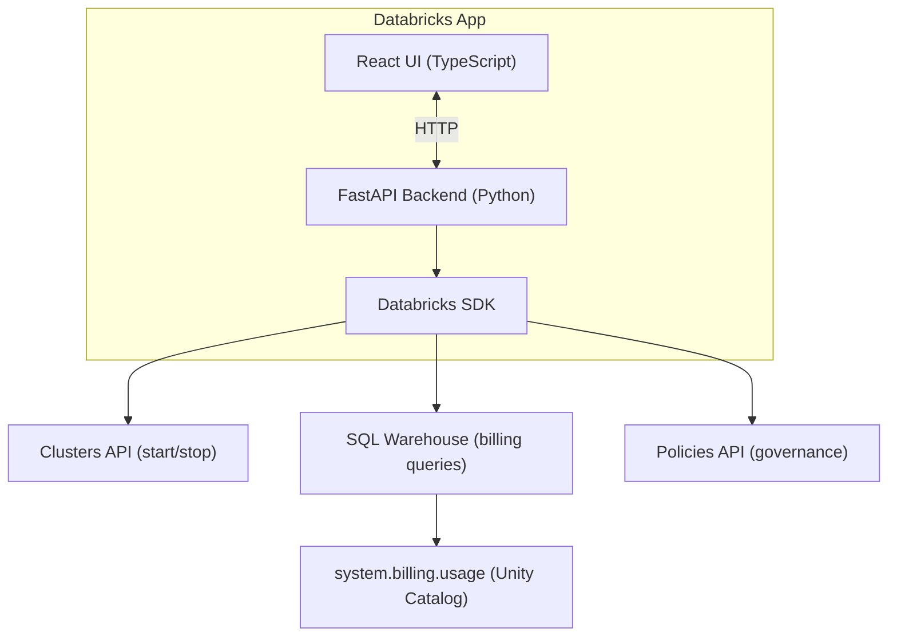
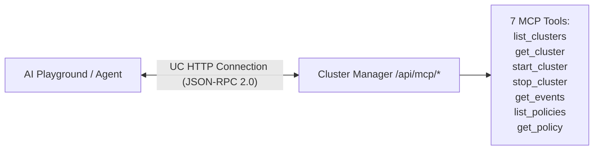
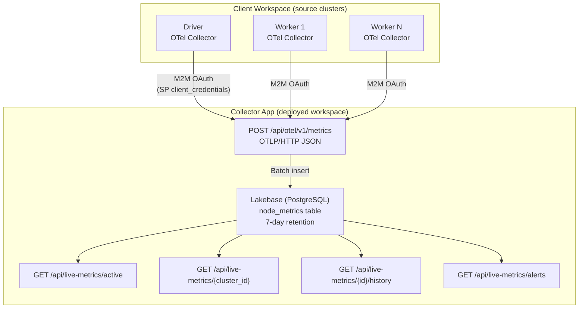
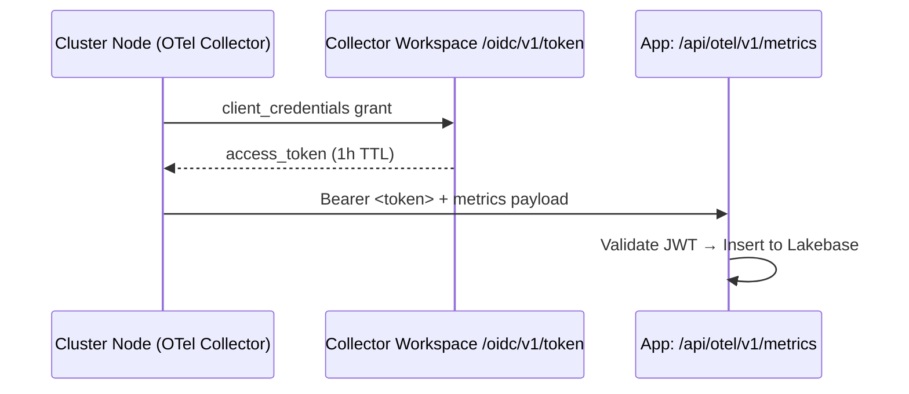

# Databricks Cluster Manager

## Administrator's Guide

A centralized management console for Databricks workspace administrators to **control costs**, **optimize resource utilization**, and **maintain governance** over compute clusters.

---

## Why This Tool?

As a Databricks administrator, you face several challenges:

| Challenge | Impact | How Cluster Manager Helps |
|-----------|--------|---------------------------|
| **Uncontrolled costs** | DBU expenses can spiral without visibility | Real-time cost tracking with Unity Catalog billing data |
| **Idle resources** | Running clusters with no activity waste money | Automated idle detection with wasted DBU calculations |
| **No single pane of glass** | Switching between UI, CLI, and notebooks | Unified dashboard for all cluster operations |
| **Risky operations** | Accidental cluster deletion causes disruption | Safe Mode prevents permanent cluster termination |
| **Configuration drift** | Clusters without auto-termination or autoscaling | Actionable optimization recommendations |

---

## Key Objectives

### 1. Cost Visibility & Control

**Problem**: DBU costs accumulate across dozens of clusters with no easy way to identify cost drivers.

**Solution**:
- **Billing Dashboard** pulls data from `system.billing.usage` Unity Catalog table
- View total DBU consumption over configurable time periods (7/30/90 days)
- Identify **top consuming clusters** with percentage breakdown
- Track **daily usage trends** to spot anomalies
- Estimated cost calculations (configurable DBU rate)

```
Example insight: "Cluster 'data-science-dev' consumed 2,450 DBUs (35% of total)
in the last 30 days, estimated cost: $367.50"
```

### 2. Idle Resource Detection

**Problem**: Clusters left running overnight or over weekends drain budget.

**Solution**:
- Automatic detection of clusters running with **no activity for 30+ minutes**
- **Wasted DBU calculation** showing exactly how much idle time costs
- Prioritized alerts sorted by cost impact
- Direct action: stop idle clusters with one click

```
Example alert: "Cluster 'analytics-prod' has been idle for 4 hours 23 minutes.
Estimated wasted DBUs: 52.3 (~$7.85)"
```

### 3. Optimization Recommendations

**Problem**: Sub-optimal cluster configurations increase costs without improving performance.

**Solution**: Automated analysis generates actionable recommendations:

| Issue Detected | Recommendation | Priority |
|----------------|----------------|----------|
| No auto-termination | Set 30-120 min timeout | High |
| Large fixed-size cluster (10+ workers) | Enable autoscaling | Medium |
| Running 24+ hours continuously | Review if needed; use job clusters | Medium/High |
| Wide autoscale range (>20 workers) | Consider tighter bounds | Low |
| Old Databricks Runtime (<13.x) | Upgrade for 20%+ performance gains | Low |

> **Deep Dive**: See [Optimization Strategies](docs/OPTIMIZATION_STRATEGIES.md) for all 42+ optimization checks across 12 categories, with detailed savings estimates for administrators and cost controllers.

### 4. Safe Cluster Operations

**Problem**: Administrative accidents (wrong cluster terminated) cause production outages.

**Solution**: **Safe Mode** by design:
- **Start** clusters - Enabled
- **Stop** clusters (preserves configuration) - Enabled
- **Terminate/Delete** clusters - Disabled

This ensures no permanent cluster loss through the UI. Configuration remains intact for restart.

### 5. Policy Compliance Monitoring

**Problem**: Clusters created outside of approved policies bypass governance controls.

**Solution**:
- View all cluster policies in the workspace
- See which clusters use which policies
- Identify clusters running without any policy (potential governance gap)

---

## Dashboard Views

### Clusters Overview
- **Real-time status**: Running, Pending, Terminated, Error
- **Resource allocation**: Workers, node types, autoscale settings
- **Uptime tracking**: How long each cluster has been running
- **Quick actions**: Start/Stop with confirmation

### Analytics
- **Cost summary cards**: Total DBUs, estimated cost, time period
- **Trend charts**: Daily DBU consumption visualization
- **Top consumers**: Ranked list with percentage of total
- **Per-cluster breakdown**: Drill-down into individual cluster costs

### Policies
- **Policy inventory**: All cluster policies with definitions
- **Usage mapping**: Which clusters are using each policy
- **Compliance gaps**: Clusters without policy assignment

---

## Architecture



### MCP Server Integration

The app also exposes a **Managed MCP Server** for AI agent integration via Databricks AI Playground:



See [MCP Server Guide](docs/MCP_SERVER.md) for setup instructions.

### Live Metrics Pipeline (OTel)

Real-time CPU, memory, disk, and network metrics from cluster nodes via OpenTelemetry:



**Key Features:**
- **Multi-workspace**: Any workspace can push metrics to the central collector
- **Multi-node**: Every node (driver + workers) reports independently
- **M2M OAuth**: Service Principal authentication (no static tokens)
- **15-second resolution**: Near real-time visibility
- **Zero-config init script**: Defaults embedded, just attach to cluster

**Metrics Collected:**
| Metric | Description |
|--------|-------------|
| `cpu_user_percent` | CPU user time |
| `cpu_system_percent` | CPU system time |
| `cpu_wait_percent` | CPU I/O wait |
| `mem_used_percent` | Memory utilization |
| `disk_used_percent` | Disk utilization |
| `network_sent_bytes` | Network TX bytes |
| `network_received_bytes` | Network RX bytes |
| `load_1m` / `load_5m` / `load_15m` | System load averages |

**Setup:**
1. Upload OTel Collector binary to a Unity Catalog Volume (see below)
2. Upload init script to client workspace (Workspace path recommended)
3. Add NAT IP of client workspace to collector workspace IP allowlist (if applicable)
4. Attach init script to cluster — no env vars needed (defaults embedded)
5. Bootstrap Lakebase pool: visit the app once as a human user, or `POST /api/otel/bootstrap`
6. Metrics flow automatically on cluster start

---

## OTel Init Script Setup

### Prerequisites

| Requirement | Purpose |
|-------------|---------|
| OTel Collector binary in UC Volume | Fast startup (avoids GitHub download on every cluster start) |
| Workspace init script path | Avoids UC Artifact Allowlist restrictions |
| Service Principal (SP) on collector workspace | M2M OAuth for cluster-to-app auth |
| IP allowlist entry (if workspace has IP ACL) | Allow client workspace NAT IPs to reach the app |

### Step 1: Download and Upload OTel Collector Binary

Download the latest `otelcol-contrib` binary and upload to a UC Volume accessible from your clusters:

```bash
# Check latest version at: https://github.com/open-telemetry/opentelemetry-collector-releases/releases

VERSION=0.116.0
ARCH=linux_amd64

# Download
curl -sL -o /tmp/otelcol-contrib.tar.gz \
  "https://github.com/open-telemetry/opentelemetry-collector-releases/releases/download/v${VERSION}/otelcol-contrib_${VERSION}_${ARCH}.tar.gz"

# Extract binary
tar xzf /tmp/otelcol-contrib.tar.gz -C /tmp otelcol-contrib

# Upload to Volume (adjust catalog/schema/volume as needed)
databricks fs cp /tmp/otelcol-contrib \
  dbfs:/Volumes/main/cluster_manager/binaries/otelcol-contrib \
  --profile "YOUR_PROFILE"

# Verify
databricks fs ls dbfs:/Volumes/main/cluster_manager/binaries/ --profile "YOUR_PROFILE"
```

> **Why pre-stage?** Downloading from GitHub on every cluster start adds 10-30s latency and can fail due to rate limits or network policies. A Volume-staged binary starts in <2s.

### Step 2: Upload Init Script to Workspace

```bash
# Upload the init script (from repo: cluster_manager/otel/init_script.sh)
databricks workspace import \
  /Users/you@company.com/init_scripts/init_otel_metrics.sh \
  --file cluster_manager/otel/init_script.sh \
  --format AUTO --overwrite \
  --profile "YOUR_PROFILE"
```

> **Why Workspace path (not Volumes)?** UC Artifact Allowlist on some workspaces blocks init scripts from Volumes. Workspace paths bypass this restriction.

### Step 3: Configure the Init Script

The script has **centralized defaults** — no env vars required for standard deployments:

```bash
# Defaults embedded in the script (override via cluster env vars if needed):
OTEL_ENDPOINT="https://<your-app>.aws.databricksapps.com"
OTEL_VOLUME_PATH="/Volumes/main/cluster_manager/binaries"
OTEL_INTERVAL="15s"
OTEL_SP_CLIENT_ID="<service-principal-client-id>"
OTEL_SP_CLIENT_SECRET="<service-principal-secret>"
OTEL_TOKEN_ENDPOINT="https://<your-workspace>.cloud.databricks.com/oidc/v1/token"
```

To override for a specific cluster, set env vars in `spark_env_vars`:
```json
{
  "OTEL_ENDPOINT": "https://your-app.databricksapps.com",
  "OTEL_INTERVAL": "30s"
}
```

### Step 4: Attach to Cluster

In cluster configuration → Advanced → Init Scripts:
- **Source**: Workspace
- **Path**: `/Users/you@company.com/init_scripts/init_otel_metrics.sh`

Or via cluster policy for org-wide deployment:
```json
{
  "init_scripts.0.workspace.destination": {
    "type": "fixed",
    "value": "/Users/admin@company.com/init_scripts/init_otel_metrics.sh"
  }
}
```

### Step 5: Allow Client Workspace IP (if applicable)

If your collector workspace has an IP allowlist enabled, add the NAT IP of the client workspace(s) that will push metrics:

```bash
# Find your client workspace's outbound IP (run on a cluster in that workspace):
# curl -s ifconfig.me

# Add to collector workspace allowlist:
databricks api post /api/2.0/ip-access-lists \
  --json '{"label": "otel-<workspace-name>", "list_type": "ALLOW", "ip_addresses": ["<NAT_IP>/32"]}' \
  --profile "COLLECTOR_WORKSPACE_PROFILE"
```

### Step 6: Bootstrap Lakebase

Lakebase requires a human user OAuth token (not SP). Visit the app once in your browser, or call:

```bash
# Get your user token
TOKEN=$(databricks auth token --profile YOUR_PROFILE -o json | jq -r '.access_token')

# Bootstrap
curl -X POST "https://<your-app>.aws.databricksapps.com/api/otel/bootstrap" \
  -H "Authorization: Bearer $TOKEN"
```

### M2M OAuth Security (Service Principal Configuration)

The OTel pipeline uses **Machine-to-Machine OAuth** (client_credentials grant) so that cluster nodes can authenticate to the collector app without human interaction.

#### Architecture



#### Step-by-Step: Create Service Principal

1. **Create a Service Principal** on the collector workspace (Account Console → Service Principals):

```bash
# Via Account API
databricks account service-principals create \
  --json '{"display_name": "otel-collector-sp", "active": true}' \
  --profile YOUR_ACCOUNT_PROFILE
```

2. **Generate OAuth Secret** for the SP:

```bash
# Account Console → Service Principals → otel-collector-sp → OAuth secrets → Generate
# Save: client_id and client_secret
```

3. **Grant Workspace Access** — add SP to the collector workspace:

```bash
# Account Console → Workspaces → <your workspace> → Permissions → Add SP
# Or via API:
databricks workspace assign-principal \
  --principal-id <SP_ID> \
  --permissions "USER" \
  --profile YOUR_ACCOUNT_PROFILE
```

4. **Test Token Generation**:

```bash
# Verify the SP can get tokens
curl -s -X POST "https://<your-workspace>.cloud.databricks.com/oidc/v1/token" \
  -H "Content-Type: application/x-www-form-urlencoded" \
  -d "grant_type=client_credentials&client_id=<CLIENT_ID>&client_secret=<CLIENT_SECRET>&scope=all-apis"

# Should return: {"access_token": "eyJ...", "token_type": "Bearer", "expires_in": 3600}
```

#### Token Flow at Runtime

1. Init script starts → requests token via `client_credentials` grant
2. Token endpoint returns JWT (1-hour TTL)
3. Collector includes `Authorization: Bearer <token>` on every push
4. App validates JWT format (3-part dot-separated)
5. App proxy adds `X-Forwarded-Access-Token` header
6. SP tokens (sub=UUID) authenticate the push but **cannot** write to Lakebase
7. Lakebase writes use a **cached human user token** (sub=email@)

#### Key Security Properties

| Property | Detail |
|----------|--------|
| **No static tokens** | SP credentials generate short-lived JWTs (1h) |
| **Scope isolation** | SP has minimal permissions — only `all-apis` scope for token endpoint |
| **Token type discrimination** | JWT `sub` claim: human=`email@`, SP=`UUID` |
| **Lakebase protection** | Only human user tokens accepted for DB writes |
| **IP-level filtering** | Workspace IP allowlist restricts which IPs can reach the app |
| **Credential rotation** | Generate new secret → update init script defaults → restart clusters |

#### Rotating SP Credentials

```bash
# 1. Generate new secret (old one still works)
# Account Console → SP → OAuth secrets → Generate new

# 2. Update init script with new secret
# Edit OTEL_SP_CLIENT_SECRET default in init_script.sh

# 3. Re-upload init script
databricks workspace import /Users/.../init_otel_metrics.sh \
  --file cluster_manager/otel/init_script.sh --format AUTO --overwrite

# 4. Restart clusters (or wait for next cluster start)

# 5. Delete old secret after all clusters rotated
# Account Console → SP → OAuth secrets → Delete old
```

### Driver/Worker Detection

The init script identifies driver vs worker nodes:
- **DBR < 17**: Uses `DB_IS_DRIVER` env var (set by Databricks)
- **DBR 17+**: Falls back to comparing `spark.driver.host` in Spark config against local IP
- **Fallback**: Defaults to `worker` if detection unavailable at init time

### Troubleshooting

| Symptom | Cause | Fix |
|---------|-------|-----|
| `INIT_SCRIPT_FAILURE` | UC Artifact Allowlist blocks Volume path | Use Workspace path instead |
| HTTP 403 from collector | Client IP not in workspace allowlist | Add NAT IP to allowlist |
| HTTP 401 from collector | SP token expired or invalid | Check SP credentials in script |
| Metrics not in dashboard | Lakebase not bootstrapped | Visit app in browser or call `/api/otel/bootstrap` |
| All nodes show as "Worker" | `DB_IS_DRIVER` not set + Spark not started at init time | Expected on DBR 17+; dashboard still groups correctly |
| Slow cluster start (+30s) | Binary download from GitHub | Pre-stage binary in Volume |

---

## Prerequisites

Before deploying, ensure you have:

| Requirement | Purpose | How to Verify |
|-------------|---------|---------------|
| **Unity Catalog** | Access to `system.billing.usage` table | `SELECT * FROM system.billing.usage LIMIT 1` |
| **SQL Warehouse** | Execute billing queries | Check SQL Warehouses in workspace |
| **Cluster Admin permissions** | Start/stop clusters | `CAN_MANAGE` on clusters |
| **Databricks CLI** | Deploy the app | `databricks auth login` |

---

## Deployment

### Quick Start

```bash
# Clone and deploy
git clone https://github.com/LaurentPRAT-DB/cluster-manager.git
cd cluster-manager

# Deploy to your workspace
databricks bundle deploy -t dev

# Access the app
databricks bundle open -t dev
```

### Configuration

Set the SQL Warehouse for billing queries:

```bash
# Option 1: Via deployment variable
databricks bundle deploy -t dev -var="sql_warehouse_id=abc123def456"

# Option 2: Via environment variable
export CLUSTER_MANAGER_SQL_WAREHOUSE_ID=abc123def456
```

---

## API Reference

### Cluster Operations
| Endpoint | Method | Description |
|----------|--------|-------------|
| `/api/clusters` | GET | List all clusters with state and metrics |
| `/api/clusters/{id}` | GET | Detailed cluster configuration |
| `/api/clusters/{id}/start` | POST | Start a terminated cluster |
| `/api/clusters/{id}/stop` | POST | Stop a running cluster (Safe Mode) |
| `/api/clusters/{id}/events` | GET | Recent cluster events |

### Billing & Analytics
| Endpoint | Method | Description |
|----------|--------|-------------|
| `/api/billing/summary` | GET | Total DBU usage and estimated cost |
| `/api/billing/by-cluster` | GET | DBU breakdown per cluster |
| `/api/billing/trend` | GET | Daily usage for charting |
| `/api/billing/top-consumers` | GET | Ranked list of cost drivers |

### Metrics & Recommendations
| Endpoint | Method | Description |
|----------|--------|-------------|
| `/api/metrics/summary` | GET | Workspace-wide cluster metrics |
| `/api/metrics/idle-clusters` | GET | Idle cluster alerts with wasted DBU |
| `/api/metrics/recommendations` | GET | Optimization suggestions |

### Policies
| Endpoint | Method | Description |
|----------|--------|-------------|
| `/api/policies` | GET | List all cluster policies |
| `/api/policies/{id}` | GET | Policy details |
| `/api/policies/{id}/usage` | GET | Clusters using this policy |

### Live Metrics (OTel)
| Endpoint | Method | Description |
|----------|--------|-------------|
| `/api/otel/v1/metrics` | POST | Receive OTLP/HTTP JSON metrics from collectors |
| `/api/otel/bootstrap` | POST | Bootstrap Lakebase pool with user token |
| `/api/live-metrics/active` | GET | List clusters currently reporting live metrics |
| `/api/live-metrics/{id}` | GET | Latest metrics for all nodes in a cluster |
| `/api/live-metrics/{id}/history` | GET | Time-series metrics (configurable window) |
| `/api/live-metrics/alerts` | GET | Nodes exceeding CPU/memory/disk thresholds |

### MCP Server (AI Agent Integration)
| Endpoint | Method | Description |
|----------|--------|-------------|
| `/api/mcp/health` | GET | Server health and capabilities |
| `/api/mcp/tools` | GET | List available MCP tools |
| `/api/mcp` | POST | JSON-RPC 2.0 endpoint for tool execution |

---

## Security Considerations

- **Authentication**: Uses Databricks App OAuth (inherits user permissions)
- **Authorization**: Operations are limited to what the logged-in user can perform
- **Safe Mode**: No permanent cluster deletion through this UI
- **Audit**: All actions are logged through standard Databricks audit logs
- **OTel M2M Auth**: Service Principal client credentials flow for cluster-to-app communication
- **IP ACL**: If your workspace has an IP allowlist, it controls which client workspaces can push metrics
- **Token Isolation**: SP tokens authenticate the push; Lakebase writes use cached human user tokens only

---

## Roadmap

Future enhancements for administrators:

- [x] **Live metrics pipeline**: Real-time OTel metrics from cluster nodes via Lakebase
- [x] **Multi-workspace support**: Any workspace can push metrics to central collector
- [x] **MCP Server**: AI agent integration via JSON-RPC 2.0
- [ ] **Live metrics dashboard**: Frontend charts for real-time node metrics
- [ ] **Teams/Slack integration**: Conversational cluster management via chat
- [ ] **Scheduled reports**: Weekly cost summary emails
- [ ] **Budget alerts**: Notifications when DBU thresholds are exceeded
- [ ] **Auto-stop policies**: Automatically stop idle clusters based on live metrics
- [ ] **Tag-based cost allocation**: Group costs by team/project tags
- [ ] **SP token rotation**: Automated credential rotation for OTel collectors

---

## Documentation

| Document | Description |
|----------|-------------|
| [Architecture](docs/ARCHITECTURE.md) | System architecture, data flows, and technology stack |
| [API Reference](docs/API.md) | Complete API documentation with examples |
| [Deployment Guide](docs/DEPLOYMENT.md) | Local development, deployment, and operations |
| [Contributing Guide](docs/CONTRIBUTING.md) | Development workflow and coding standards |
| [Data Dictionary](docs/DATA_DICTIONARY.md) | All data models and schemas |
| [Optimization Strategies](docs/OPTIMIZATION_STRATEGIES.md) | Complete guide to all 42+ cost optimization checks |
| [MCP Server Guide](docs/MCP_SERVER.md) | Transform your app into a managed MCP server for AI agents |

### External References

| Resource | Description |
|----------|-------------|
| [Databricks Cost Management](https://docs.databricks.com/administration-guide/account-settings/billable-usage.html) | Official Databricks billing documentation |
| [Cluster Best Practices](https://docs.databricks.com/clusters/cluster-config-best-practices.html) | Databricks cluster configuration guide |
| [Databricks Apps](https://docs.databricks.com/en/dev-tools/databricks-apps/index.html) | Databricks Apps platform documentation |

---

## Support

For issues or feature requests, please contact your platform team or open an issue in the repository.

---

## License

MIT
